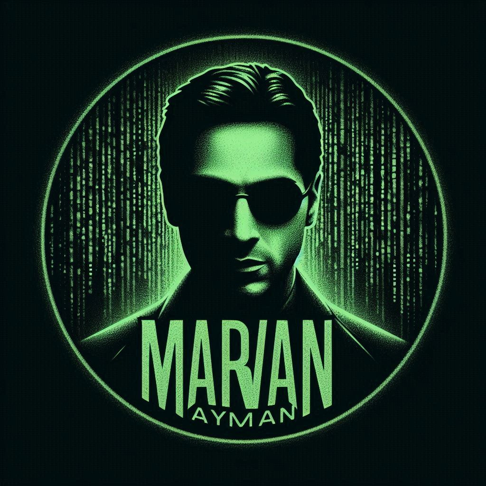

# Welcome to My GitHub Profile! 🧠✨

---

## About Me 🌟
Hey there! I'm **Maro**, a passionate developer with a love for solving puzzles and creating innovative solutions. Here’s a little about me:

* 🌍 Based in **Cairo, Egypt**
* 💻 I enjoy crafting elegant code and learning **cutting-edge technologies**.
* 🌟 On a mission to build **impactful projects** that make a difference.
* 🧠 Constantly curious and always exploring new ideas.

When I’m not coding, you’ll find me:
* 🎮 Gaming and uncovering epic adventures
* 📖 Reading about tech trends and industry insights
* 🎵 Exploring new music and creating playlists that match my mood.

Want to connect? Let’s make magic happen! 🌈

---

## My Skills 🚀

  
  

    
    ### 🚀 Programming Languages
    
    

      
      
      
      
    

    
  

  
  

    
    ### 🛠️ Tools
    
    

      
      
      
      
      
    

    
  

  

  
  

    
    ### ☁️ Cloud Platforms
    
    

      
      
      
      
    

    
  

  
  

    
    ### 🖥️ Operating Systems
    
    

      
      
    

    
  

  

